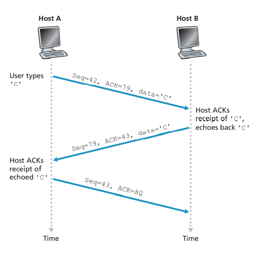
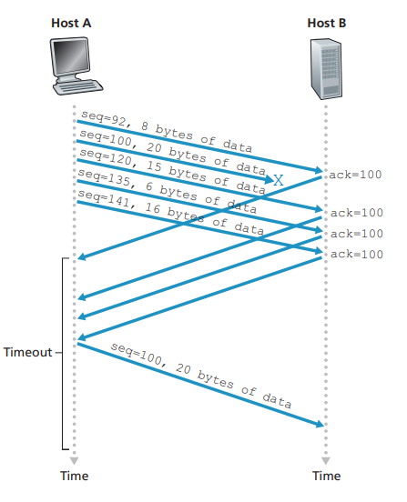
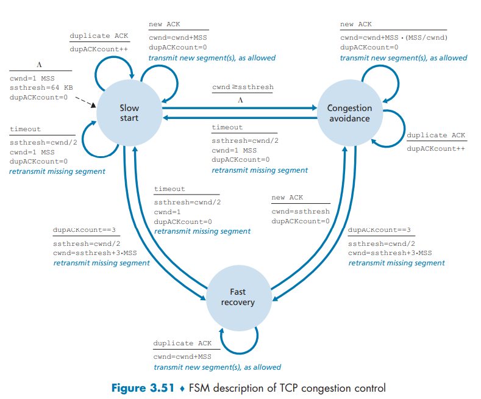
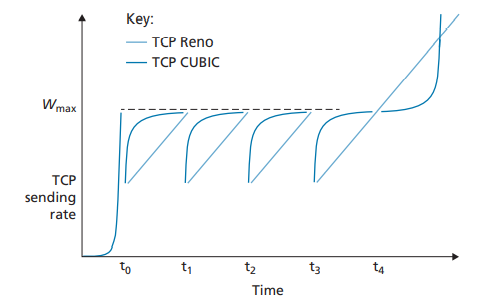

IP: - packets (general term)
	- best-effort delivery service BUT unreliable (no garantee of delivery -> order, integrity)

##### Overview
process-to-process communication

- UDP: - datagrams
	- unreliable (no gurantee of delivery -> order)
	- not regulated (can send at any rate for as long as it pleases)
	- integrity&error checking
- TCP: - segments
	- integrity&error checking
	- reliable (flow control, sequence numbers, acknowledgements, timeouts) -> delivered to process correctly & in order
	- congestion control (regulate rate at which the sending sides can send traffic into network)

##### Multiplexing(multiple signals over shared medium)/demultiplexing to ports
port is a 16-bit number -> 2^16 = 65536 possible ports -> 0 - 65535 range
0-1023 well-known ports

Both UDP and TCP datagrams/segments - 2x16-bit port nr. fields. (for source&destination port nr.)

UDP socket identified by - dst. IP address & dst. port nr. (connectionless)
TCP socket identified by - dst. IP address & dst. port nr. AND source IP address & source port nr.

##### UDP
- better application-layer control over what data are send, and when (no congestion-control throttling)
- no connection-establishment delay
- no connection state data (like receive&send buffers, congestion control parameters, sequence and acknowledgement nr. parametes) -> less computing load
- small packet header overhead (8 bytes in UDP vs 20 bytes in TCP)

e.g. DNS (avoid connection establishment delay), SNMP simple network management protocol (must run even over network in stressed state)

It's possible to bake reliability into application itself, and thus - use fast and reliable comunication without congestion control (QUIC protocol)
BUT
congestion control is needed. When routers are in congested state - only few packets would successfully transverse the source-destination path.  
TCP senders would get especially fked, bcos they do decrease they're sending rate

###### datagram structure
[RFC 768](https://datatracker.ietf.org/doc/html/rfc768)

- header - 4 fields, each consisting 2 bytes:
	- source port
	- dst. port
	- lengh - datagram lengh (header + application data) in bytes
	i.e. max. = 2^16 = 65,536 kB/datagram
	- checksum - used by receiving host to check for errors. Calculated also by few of the IP header fields and link-layer protocols. You never know if error occured e.g. when datagram was stored in router memory.
	It looks like lower level functions are redundant

##### TCP
###### Reliable data transfer - contemplations:
- ARQ (Automatic Repeat reQuest protocols) - in computer networking - error control method using both **positive acknowledgements** (e.g. "I understand") and **negative acknowledgements** ("Please repeat that"):
	- error detection
	- receiver feedback
	- retransmission

- [GBN (Go-Back-N) aka sliding-window protocol](https://media.pearsoncmg.com/aw/ecs_kurose_compnetwork_7/cw/content/interactiveanimations/go-back-n-protocol/index.html)
	- can send multiple packets without waiting for ACK BUT only up to max. nr. of N (aka `window size`)
	- if `base` is sequence nr. of oldest unACKed packet and `nextseqnum` is the smallest unused sequence nr. -> [0, base-1] - packets sent & ACKed, [base, nextseqnum - 1] - sent NOT ACKed, [nextseqnum, base + N - 1] - not sent yet, but can be if upper layer passes data, [>= base + N] - cannot be sent until `base` is ACKed
	- if *k* is the nr. of bits in packet squence nr. field -> [0, 2^k -1] seq. nr. range
	in TCP - 32 bit seq. nr. field
	- timer tracks `ACK` of the oldest packet. If an `ACK` is received but there are still additional notACKed packets - timer restart. If timeout occurs - all sent unACKed packets are resent
	- If receiver get correct packet, in-order it sends ACK and delivers packet to upper layer.
	If sth is not ok. with packet (e.g. not in-order) - packet is discarded, and ACK of the last in-order packet is resent (telling - "resend what was supposed after this")
	- packets are processed one-at-time by receiver. So if packet `n` is delivered, than every packet with seq. nr < `n` is delivered -> **cumulative ACK**
	- 
	- Window aka pipeline sending can cause performance troubles.
	If window size & bandwidth-delay are large -> a single packet error can lead to unnecessary reiteration of a bunch of packets

- [Selective Repeat](https://computerscience.unicam.it/marcantoni/reti/applet/SelectiveRepeatProtocol/selRepProt.html) - avoid unnecessary retransmissions
	- receiver `ACK` all correctly transmitted packets (also these our-of-order)
	- Out-of-order packets are buffered at receiver side, until previous are resent.
	They wait for previous packet in buffer, and are delivered to upper layer in order
	- sender retransmit only these packets that it suspects were received in error
	- 
	- `window size` MUST be <= 1/2 `seq. nr. range` -> otherwise ACK's for next `seq. nr. range` packets might ACK notACKed (lost ACK) packets from previous `window` packets !!!
	- Data from above - SR sender checks next available seq. nr. for packet. If nr. in `window` -> data packetized and sent.
	Otherwise -> buffered or return to the upper layer
	- Timeout - timer for each packet. Hardware timer can be used to mimic the operation of multiple logical timers
	- If reciever get packet it already have - it sends back `ACK`. Previous ACK might have been lost

If packet reordering is possible, than "lost in network" old packets (e.g. ACK) with seq. nr. `x` might arrive, even tho `x` is not in receiver nor sender `window`.
That's why we have (TTL time to live). In TCP extensions for high-speed networks TTL ~3 min. **Sender won't use seq. nr. until he's sure there is no such packet in network.**

###### TCP connection basics
- full-duplex
- unicast (multicast is NOT possible with TCP)
- Data stream from upper layer -> `send buffer`.
  TCP can grab chunks of data and pass into network.
- `MSS` (maximum segment size) - maximum chunk of application-layer data in segment.
  Set by first determining `MTU` (maximum transmission unit) - length of the largest link-layer frame that can be sent by the local sending host -> `MSS` is set so as to ensure `TCP segment` plus `TCP/IP header` length will fit into single link-layer frame (typically ~ 40 bytes)
Both `Ethernet` and `PPP` link-layer protocols have `MTU` ~ 1500 bytes -> typical `MSS` ~ 1460 bytes.
Sometimes to estimate `MSS`, we use `MTU path` - largest link-layer frame that can be sent over all links from source -> dst.
- Data from received packets -> `receive buffer` -> application layer
RFC's don't regulate if receiver should discard or buffer out-of-order packets, but the latter choice is common

###### TCP segment structure
- header:
	- source port [16 bit = 2 bytes]
	- dst. port [16 bit = 2 bytes]
	- HLEN (header length field) [4 bit] - lengh of TCP header in 32-bit (4 byte) words. E.g. if [TCP header = 20 bytes (no options - typical/minimal segment header)] -> field will hold decimal 5 (5X4=20 bytes). Max. field size is 2^1+2^2+2^3+2^4=15. 15X4=60, and 60 bytes is max. TCP header size.
	- checksum [16 bit = 2 bytes]
	- seq. nr. field [32 bit = 4 bytes]
	- ack. nr. field [32 bit = 4 bytes]
	- receive window [16 bit = 2 bytes]
	- options field - optional. For sender-receiver `MSS negotiation`, `window scaling factor`, `time-stamping` ([RFC 854](https://www.rfc-editor.org/rfc/rfc854) and [RFC 1323](https://datatracker.ietf.org/doc/html/rfc1323)) [0-40 bytes]
	- flag field [6 bit]:
		- `ACK` - bit set if value carried in ack. nr. field is valid
		- `SYN`, `FIN`, `RST` - bits for connection setup and teardown
		- `PSH` - indicates that receiver should pass the data to the upper layer immediately
		- `URG` - indicate that data in this segment was marked as "urgent" by sending-side upper-layer entity -> location of urgend data is indicated in `urgent data pointer` [16 bit]. 
		  In practice `PSH` and `URG` are rather not used
	- urgent data pointer [16 bit]
	- reserved [6 bit]:
		- `CWR`, `ECE` - bits for explicit congestion notification

###### Seq. nr & ack. nr.
- `seq. nr.` for a segment: - nr. of the first byte (of data stream) in the segment  
seq. nr. of the first byte is chosen randomly to minimize possibility that a "lost-in-network" segment from previous connection get's mistaken for valid segment  
- `ack. nr.` - nr. of the next `seq. nr.` that host is expecting from the other side  
TCP acknowledges bytes up to the first missing byte in the stream -> `cumulative acknowledgments`

`ACK` for client-to-server data is carried in a server-to-client data -> it is "`piggybacked`"
Even tho last segment DOESN'T contain any data - it has `seq. nr.` = 43 (it has to have some)

[So both segments carrying 1byte of data and empty creates incrementation == 1]

###### Round-trip time estimation & timeout
[RCF 6298](https://www.rfc-editor.org/rfc/rfc6298)

`Sample RTT` - time from passing segment to IP layer to it's `ACK`  
TCP take only one `Sample RTT` for a time (not for each and every segment)  

`Estimated RTT` is a weighted average of `Sample RTT` values  
this weighed average is called `EWMA` (exponential weighted moving average) - because weight of `Sample RTT` decays exponentially fast as the uptades proceed

`Dev RTT` is a deviation/variability of the `Sample RTT`s
It's a `EWMA` of the `Sample RTT` - `Estimated RTT`
If `Dev RTT` small -> little fluctuation

`Timeout Interval` = `Estimated RTT` + 4 * `Dev RTT`
Recommended initial `Timeout Interval` = 1s

If `timeout` occurs -> `Timeout Interval` is doubled (to avoid premature timeout for subsequent segment)  
As soon as segment is received -> `Estimated RTT` is updated and `Timeout Interval` computed normally again

###### Reliable data transfer - TCP
[timer management] can require considerable overhead -> [RCF 6298](https://www.rfc-editor.org/rfc/rfc6298) recommend only a *single* retransmission timer 

`Timer` set for oldest unACKed segment.  
When timeout -> resend only timed-out (oldest unACKed) segment, 2 * `Timeout interval` AND wait for it's `ACK` (or cumulative ACK of higher segments) - without resending any other segments.  
If `ACK` - `Timeoute interval` derived from `Estimated RTT` & `Dev RTT` and further segments can be resent 
If more timeouts - `Time interval` grow exponentially -> form of `congestion control`

[RFC 5681](https://www.rfc-editor.org/rfc/rfc5681)
If out-of-order segment at receiver - `duplicate ACK` indicating `seq. nr.` of next expected byte (lower end of gap)  
If 3 `duplicate ACK` - sender knows that following segment has been lost -> `fast retransmit` of lost segment (*before* timeout)

When multiple packets are lost from one `window` of data - TCP may experience poor performance
`selective acknoledgment (SACK) option` [RFC 2018](https://datatracker.ietf.org/doc/html/rfc2018) - allows receiver to acknowledge out-of-order segments selectively.  
Combined with `selective retransmissions` policy - weapon against such limitations

###### Flow control
speed-matching service  
to eliminate the possibility of sender overflowing receiver's buffer  

- "receiver's" side (in "" bcos full-duplex connection):
`RcvBuffer` - size of allocated receiver buffer for this connection  
`LastByteRead` - last byte read from buffer by application process  
`LastByteRcvd` - last byte of data that has arrived from network and has been placed in receiver buffer  
 
so as not to overflow the buffer:  
`LasteByteRcvd` - `LastByteRead` =< `RcvBuffer`  

`rwnd` = `RcvBuffer` - (`LastByteRcvd` - `LastByteRead`)
`rwnd` - `receive window` - dynamic (spare room changes) variable to give sender idea of how much free buffer space is left at receiver  

`rwnd` variable send with each segment. Initially `rwnd` = `RcvBuffer`

- "sender's" side:
`LastByteSent` -`LastByteACKed` = amount of unACKed data sent. =< `rwnd` (of receiver)
if above == `True` -> sender is sure she'll not overflow receiver's buffer

If `rwnd` = 0 - there is a risk that receiver doesn't have anything to send to sender (with piggybacked `rwnd`) -> sender might get stuck unable to send data!
If `rwnd` = 0 -> sender **has to** continue sending one-data-byte segemnts  
(receiver `ACK` them with piggybacked `rwnd`)  

###### Connection management
Establishment:
e.g.
1. segment with set `SYN` bit, randomly chosen initial `seq. nr.` (`client_isn`), no data-> server
2. server extracts TCP SYN segment from packet -> allocates buffers and variables to conection [SYN flood DoS!] -> segment with `SYN` & `ACK` bits, `ack. nr.` (`client_isn+1`), server's own random `seq. nr.` (`server_isn`), no data -> client
3. client extracts TCP SYN/ACK segment from packet -> allocates buffers and variables to connection -> segment with `ACK` bit, `ack. nr.` (`server_isn+1`), may have data

Finishing:
e.g.
1. segment with `FIN` bit -> server
2. segment with `ACK` -> clinet
   segment with `FIN` -> client
4. segment with `ACK` -> server
after (implementation dependent) time (e.g. `30s`, `1m`, `2m`) -> release of client-side resources

If server receives `SYN` for closed port -> `RST`

- SYN cookies (defence against [SYN flood DoS]):
	- when server receive `SYN` it create a `hash` (`cookie`) of `SYN` segment's source IP, destination IP, port nrs. AND secret known only to server -> put cookie as initial `seq. nr.` of `SYN/ACK`
	  *Server don't remember cookie or any other state info. corresponding to the `SYN`*
	  **BUT secret has to be permanent, right? ?!?!?!?!?**
	- legitimate client would return `ACK` with value in `ack. nr.` == `cookie` + 1
	  server calculates what would be the value of cookie + 1 for this socket, and if statement is true -> open socket
	- if no response on `SYN/ACK` - no harm (no allocated resources)

###### Congestion control
`offered load` - rate of sending both original & retransmitted packets into network

- Congested network:
	- large queuing delays
	- retransmissions needed (to compensate for dropped packets)
	- unnecessary retransmissions might occure (due to large queuing delays)
	- if packet is dropped - resorces used by it along the path end up wasted

- Approaches to congestion control:
	- `end-to-end congestion control` - end systems infer (wnioskują) network congestion based only on network behavior
	  e.g.
	  TCP segment loss (indicated by `timeout` or 3x `duplicate ACK` (with "original" packet `ACK` that's 4x `ACK`)) -> decrease of `window size`
	  increasing `round-trip segment delay` - might also be an indicatios of network congestion
	  "classic" TCP congestion control uses `end-to-end congestion control`

	- `network-assisted congestion control` - router provide explicit feedback
	  e.g.
	  `ATM Available Bite Rate` (`ABR`) congestion control - router inform sender of max. host sending rate it can support on outgoing link
	(might be direct "I'm choked" message from router to sender, or modified sender-to-receiver packet that makes receiver forward info about congestion back to sender (notification takes full RTT))
	there exist TCP flavours using `network-assisted congestion control`

"classic" TCP `end-to-end congestion control`:

if no congestion:
	`ACK`s should be received (no `timeouts`)
	there shouldn't be a need for retransmissions (no `timeouts` nor 3x `duplicate ACK`)
	`ACK`s should be received fastly (small `RTT`)

`cwnd` - `congestion window` variable  
`cwnd` is estimated per `RTT` (faster if small `RTT`)

`LastByteSent` - `LastByteAcked` =< min{`cwnd`, `rwnd`}
so as not to congest network nor overflow receivers buffer
If we omit `rwnd` - **sender's send rate is roughly `cwnd`/`RTT` [bytes/s]**

lost segment indicators `timeout` or 3x `duplicate ACK` -> decrease `cwnd`
`ACK` -> increase `cwnd`
(TCP is `self-clocking` - use `ACK`s to trigger (clock) it's increase in `cwnd`)

`bandwidth probing` - sender increase it's sending rate until packt-drop (aka probe bandwidth - so as not to waste too much link bandwidth

TCP congestion-control algorithm:
- `slow start`:
	- when connection begins `cwnd` typically set to 1 `MSS` [RFC 3390](https://datatracker.ietf.org/doc/html/rfc3390) -> that means 1 `MSS`/`RTT` initial sending rate
	e.g. if `MSS` = 500 [bytes], `RTT` = 200 [ms] -> initial sending rate = 20 [kbps]
	- increases 1 `MSS`/`ACK`ed segment -> TCP sender rate grows exponentialy
	- if `timeout` -> set `ssthresh` (`slow start threshold`) variable = `cwnd`/2 && set `cwnd` = 1 -> `slow start` again
	- if 3x `duplicate ACK`  (less worrying than `timeout` bcos `ACK`s delivered)-> set `sstresh` = `cwnd`/2 && set `cwnd` = `sstresh` + 3`MSS` (3 `MSS` bcos of 3 `duplicate ACK`s) -> `fast recovery` (TCP Reno - recommended) or `slow start` (TCP Tahoe)
	- when `cwnd` value == `ssthresh` (== last `cwnd` before congestion detection) -> `congestion avoidance`
- `congestion avoidance`:
	- increase `cwnd` by just 1 `MSS` every `RTT` [RFC 5681](https://datatracker.ietf.org/doc/html/rfc5681) -> sender rate grows linearly
	  common approach is for the sender to increase `cwnd` by `MSS`/`cwnd` [bytes] whenever new `ACK` arrives
	  e.g. if `MSS` = 1460 [bytes], `cwnd` = 14 600 [bytes] -> sending rate = 10 segments/`RTT`
	  each `ACK` increases `cwnd` by 1/10 `MSS` leading to full 1 `MSS` increase/`RTT`
	- if `timeout` -> set `ssthresh` = `cwnd`/2 && set `cwnd` = 1 -> `slow start`
	- if 3x `duplicate ACK`-> set `sstresh` = `cwnd`/2 && set `cwnd` = `sstresh` + 3`MSS` -> `fast recovery` or `slow start`
- `fast recovery`: - recommended, not required
	- increase `cwnd` by 1 `MSS` every `duplicate ACK`  received for missing segment that caused TCP to enter `fast recovery` (to reflect segements that successfully left network) -> send new segment if permitted by new `cwnd` (try to ensure that ~ `sstrash` amount of data in network at end of `fast recovery`)
	- when `ACK` for all missing segments -> set `cwnd` = `sstresh` (`cwnd` is deflated to that of a typical "starting point" of `congestion avoidance` state) -> `congestion avoidance`
	- if `timeout` -> set `ssthresh` = `cwnd`/2 && set `cwnd` = 1 -> `slow start`

FSM - finite-state machine - abstract machine that can do exactly one of a finite states at any given time

assuming that losses are indicated by 3x `duplicate ACK`s rather than `timeouts` - TCP congestion consist of linear (additive) increase in `cwnd` (1 `MSS`/`RTT`) and than halving (multiplicative decrease) of `cwnd` on 3x `duplicate ACK`s
refered to as `additive-increase, multiplicative-decrease` (`AIMD`) form of congestion control

>case study revealed that server requires 3 TCP `windows` (during `slow start`) for a search query 
responce time ~ 4x`RTT` 
(1 to set up `SYN` - `SYN/ACK` + 3 `windows` of data)

>`TCP splitting` - breaking TCP connection at front-end server
*Client* -TCP-> nearest *front-end* server -TCP with v. large `congestion window`-> *back-end* server
reponse time ~ 4x `RTT` [^FE] + `RTT`[^BE] + processing time
if *front-end* server close to *client* - responce time ~ `RTT`
thus `TCP splitting` can reduce network delay roughly form 4x`RTT` => `RTT`
`TCP splitting` helps reduce TCP `retransmissions delays` caused by losses in `access networks`

TCP CUBIC [RFC 8312](https://datatracker.ietf.org/doc/html/rfc8312):
- changes `congestion avoidance` phase:
	- `W`[^max] - `cwnd` when congestion detected
	  `K` - point in time when `window` size again reach `W`[^max] (assuming no losses)
	- increase `cwnd` as a function of *cube* of distance between *current time* `t` and `K`
	  if `t` further away from `K` -> rapid increase of `cwnd`
	  when sending rate approach `W`[^max] -> cautious bandwidth probing
	- when `t` > `K` && `t` ~ `K` -> small `cwnd` increase
	- when `t` >> `K` -> rapid `cwnd` increase (quickly finding new operating poind, if the congestion level of the link changed significantly)

TCP CUBIC is default TCP version of Linux OS

`network-assisted congestion control`:
e.g.
- `explicit congestion notification` (`ECN`) [RFC 3168](https://www.rfc-editor.org/rfc/rfc3168.html)
	- use 2 [bits] from `type of service` field of IP header
		- 2 [bits] -> 4 possible configurations:
			1. 00 - sender set to say that sender or receiver are NOT `ECN`-capable
			2. 01 - sender-set to say both sender & receiver are `ECN`-capable (I dunno why bother with "01" and "10" since it's job looks the same)
			3. 10 - sender-set to say both sender & receiver are `ECN`-capable
			4. 11 - Congestion Experienced
	router experience congestion (hopefully *before* packet loss) - set `ECN` bit in IP header-> receiver -TCP `ACK` piggybacking `ECE` (`explicit congestion notification echo` bit)-> sender - set `cwnd` = `cwnd`/2 && set `CWR` (`Congestion Window Reduced`) bit in the next TCP header

`DCCP` (`Datagram Congestion Control Protocol`) and `DCQCN` (`Data Center Congestion Notification`) also make use of `ECN`

