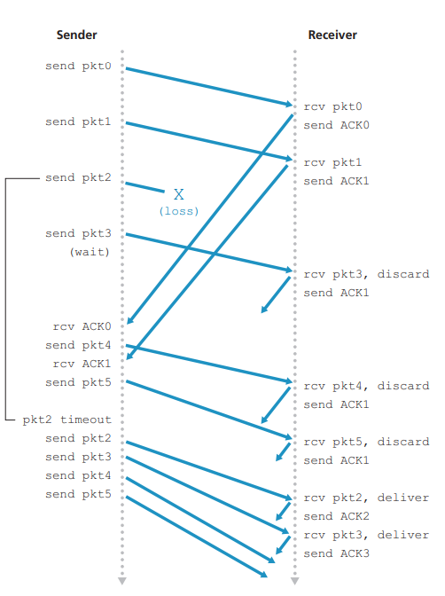
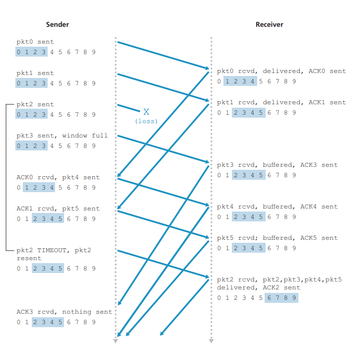

IP: - packets (general term)
	- best-effort delivery service BUT unreliable (no garantee of delivery -> order, integrity)

##### Overview
process-to-process communication

- UDP: - datagrams
	- unreliable (no gurantee of delivery -> order)
	- not regulated (can send at any rate for as long as it pleases)
	- integrity&error checking
- TCP: - segments
	- integrity&error checking
	- reliable (flow control, sequence numbers, acknowledgements, timeouts) -> delivered to process correctly & in order
	- congestion control (regulate rate at which the sending sides can send traffic into network)

##### Multiplexing(multiple signals over shared medium)/demultiplexing to ports
port is a 16-bit number -> 2^16 = 65536 possible ports -> 0 - 65535 range
0-1023 well-known ports

Both UDP and TCP datagrams/segments - 2x16-bit port nr. fields. (for source&destination port nr.)

UDP socket identified by - dst. IP address & dst. port nr. (connectionless)
TCP socket identified by - dst. IP address & dst. port nr. AND source IP address & source port nr.

##### UDP
- better application-layer control over what data are send, and when (no congestion-control throttling)
- no connection-establishment delay
- no connection state data (like receive&send buffers, congestion control parameters, sequence and acknowledgement nr. parametes) -> less computing load
- small packet header overhead (8 bytes in UDP vs 20 bytes in TCP)

e.g. DNS (avoid connection establishment delay), SNMP simple network management protocol (must run even over network in stressed state)

It's possible to bake reliability into application itself, and thus - use fast and reliable comunication without congestion control (QUIC protocol)
BUT
congestion control is needed. When routers are in congested state - only few packets would successfully transverse the source-destination path.  
TCP senders would get especially fked, bcos they do decrease they're sending rate

###### datagram structure
[RFC 768](https://datatracker.ietf.org/doc/html/rfc768)

- header - 4 fields, each consisting 2 bytes:
	- source port
	- dst. port
	- lengh - segment lengh (header + application data) in bytes
	- checksum - used by receiving host to check for errors. Calculated also by few of the IP header fields and link-layer protocols. You never know if error occured e.g. when datagram was stored in router memory.
	It looks like lower level functions are redundant

##### TCP
###### Reliable data transfer:
- ARQ (Automatic Repeat reQuest protocols) - in computer networking - error control method using both **positive acknowledgements** (e.g. "I understand") and **negative acknowledgements** ("Please repeat that"):
	- error detection
	- receiver feedback
	- retransmission

- [GBN (Go-Back-N) aka sliding-window protocol](https://media.pearsoncmg.com/aw/ecs_kurose_compnetwork_7/cw/content/interactiveanimations/go-back-n-protocol/index.html)
	- can send multiple packets without waiting for ACK BUT only up to max. nr. of N (aka `window size`)
	- if `base` is sequence nr. of oldest unACKed packet and `nextseqnum` is the smallest unused sequence nr. -> [0, base-1] - packets sent & ACKed, [base, nextseqnum - 1] - sent NOT ACKed, [nextseqnum, base + N - 1] - not sent yet, but can be if upper layer passes data, [>= base + N] - cannot be sent until `base` is ACKed
	- if *k* is the nr. of bits in packet squence nr. field -> [0, 2^k -1] seq. nr. range
	in TCP - 32 bit seq. nr. field
	- timer tracks `ACK` of the oldest packet. If an `ACK` is received but there are still additional notACKed packets - timer restart. If timeout occurs - all sent unACKed packets are resent
	- If receiver get correct packet, in-order it sends ACK and delivers packet to upper layer.
	If sth is not ok. with packet (e.g. not in-order) - packet is discarded, and ACK of the last in-order packet is resent (telling - "resend what was supposed after this")
	- packets are processed one-at-time by receiver. So if packet `n` is delivered, than every packet with seq. nr < `n` is delivered -> **cumulative ACK**
	- 
	- Window aka pipeline sending can cause performance troubles.
	If window size & bandwidth-delay are large -> a single packet error can lead to unnecessary reiteration of a bunch of packets

- [Selective Repeat](https://computerscience.unicam.it/marcantoni/reti/applet/SelectiveRepeatProtocol/selRepProt.html) - avoid unnecessary retransmissions
	- receiver `ACK` all correctly transmitted packets (also these our-of-order)
	- Out-of-order packets are buffered at receiver side, until previous are resent.
	They wait for previous packet in buffer, and are delivered to upper layer in order
	- sender retransmit only these packets that it suspects were received in error
	- 
	- `window size` MUST be <= 1/2 `seq. nr. range` -> otherwise ACK's for next `seq. nr. range` packets might ACK notACKed (lost ACK) packets from previous `window` packets !!!
	- Data from above - SR sender checks next available seq. nr. for packet. If nr. in `window` -> data packetized and sent.
	Otherwise -> buffered or return to the upper layer
	- Timeout - timer for each packet. Hardware timer can be used to mimic the operation of multiple logical timers
	- If reciever get packet it already have - it sends back `ACK`. Previous ACK might have been lost

If packet reordering is possible, than "lost in network" old packets (e.g. ACK) with seq. nr. `x` might arrive, even tho `x` is not in receiver nor sender `window`.
That's why we have (TTL time to live). In TCP extensions for high-speed networks TTL ~3 min. **Sender won't use seq. nr. until he's sure there is no such packet in network.**

###### TCP connection basics
- full-duplex
- unicast (multicast is NOT possible with TCP)
- Data stream from upper layer -> `send buffer`.
  TCP can grab chunks of data and pass into network.
- `MSS` (maximum segment size) - maximum chunk of application-layer data in segment.
  Set by first determining `MTU` (maximum transmission unit) - length of the largest link-layer frame that can be sent by the local sending host -> `MSS` is set so as to ensure `TCP segment` plus `TCP/IP header` length will fit into single link-layer frame (typically ~ 40 bytes)
Both `Ethernet` and `PPP` link-layer protocols have `MTU` ~ 1500 bytes -> typical `MSS` ~ 1460 bytes.
Sometimes to estimate `MSS`, we use `MTU path` - largest link-layer frame that can be sent over all links from source -> dst.
- Data from received packets -> `receive buffer` -> application layer

###### TCP segment structure
- header:
	- source port [16 bit = 2 bytes]
	- dst. port [16 bit = 2 bytes]
	- HLEN (header length field) [4 bit] - lengh of TCP header in 32-bit (4 byte) words. E.g. if [TCP header = 20 bytes (no options - typical/minimal segment header)] -> field will hold 5 (5X4=20 bytes). Max. field size is 2^1+2^2+2^3+2^4=15. 15X4=60, and 60 bytes is max. TCP header size.
	- checksum [16 bit = bytes]
	- seq. nr. field [32 bit = 4 bytes]
	- ack. nr. field [32 bit = 4 bytes]
	- receive window [16 bit = 2 bytes]
	- options field - optional. For sender-receiver `MSS` negotiation, window scaling factor, time-stamping ([RFC 854](https://www.rfc-editor.org/rfc/rfc854) and [RFC 1323](https://datatracker.ietf.org/doc/html/rfc1323)) [0-40 bytes]
	- flag field [6 bit]:
		- `ACK` - bit set if value carried in ack. nr. field is valid
		- `SYN`, `FIN`, `RST` - bits for connection setup and teardown
		- `PSH` - indicates that receiver should pass the data to the upper layer immediately
		- `URG` - indicate that data in this segment was marked as "urgent" by sending-side upper-layer entity -> location of urgend data is indicated in `urgent data pointer` [16 bit]. In practice `PSH` and `URG` are rather not used
	- urgent data pointer [16 bit]
	- reserved [6 bit]:
		- `CWR`, `ECE` - bits for explicit congestion notification

###### Seq. nr & ack. nr.
